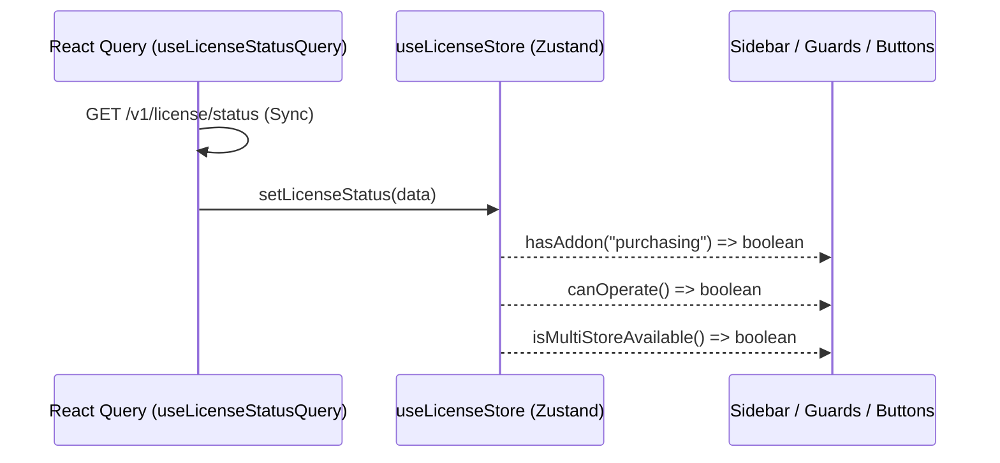

# Rencana Implementasi: Feature Gating Lisensi Add-Ons & License Management

Dokumen ini berisi arsitektur, pemetaan modul (Core vs 11 Add-On), integrasi Zustand Store, fitur Adjustment Qty di Master Produk, dan tahapan teknis implementasi feature gating serta penyempurnaan manajemen lisensi pada frontend POS Multi-Store.

---

## 1. Pemetaan Akses Fitur (Core POS vs 11 Modul Add-On)

Aplikasi POS memiliki pembagian akses yang tegas antara **fitur operasional dasar** (selalu dapat diakses tanpa add-on) dan **fitur add-on spesifik** (memerlukan kode add-on pada `active_addons` lisensi).

```mermaid
graph TD
    A["License Status (active / grace_period)"] -->|can_operate: true| B["Core POS Features (Bebas / Tanpa Add-On)"]
    A -->|can_operate: true| C["Active Add-Ons Array"]
    
    B --> B1["Layar Kasir POS /checkout"]
    B --> B2["Sesi Kasir & Transaksi Penjualan"]
    B --> B3["Master Produk + Fitur Adjustment Qty"]
    B --> B4["Katalog Visual, Kategori, Brand, & Satuan"]
    B --> B5["Kartu Stok Dasar & Kas Akun"]
    B --> B6["Pengaturan Toko, User, & Karyawan"]
    B --> B7["Kelola 1 Toko Utama / Cabang Default"]

    C -->|purchasing| D1["Pembelian, PO, Penerimaan, Vendor Supplier"]
    C -->|debts| D2["Hutang Sales & Piutang Member"]
    C -->|expenses| D3["Catatan Biaya & Kategori Pengeluaran"]
    C -->|members| D4["Daftar Member / Pelanggan CRM"]
    C -->|stock_opname| D5["Audit Stock Opname Massal & Jadwal Opname"]
    C -->|reports| D6["Laporan Analitik, Laba Rugi, & Penjualan"]
    C -->|accounting| D7["Jurnal, COA, Buku Besar, & Neraca Keuangan"]
    C -->|consignment| D8["Penerimaan & Pelunasan Konsinyasi"]
    C -->|production| D9["Manufaktur, SPK, BOM Produk & Komponen"]
    C -->|assets| D10["Manajemen Aset & Depresiasi"]
    C -->|multi_store| D11["Transfer Stok, Request Cabang, Central Reports, Toko ke-2+"]
```



### A. Fitur Core POS (Bebas / Tanpa Add-On)
Selama lisensi berstatus `active` atau dalam `grace_period` dengan `can_operate: true`, seluruh fitur berikut dapat diakses penuh oleh semua pengguna:

| Kategori Fitur | Rute URL | Deskripsi Operasional |
| :--- | :--- | :--- |
| **Layar Kasir (POS)** | `/checkout` | Penjualan kasir, barcode scanner, multi-metode pembayaran, cetak struk |
| **Sesi Kasir** | `/admin/cash-drawer` | Buka modal awal kasir, laci kasir, tutup shift, kas keluar kasir |
| **Daftar Transaksi** | `/admin/transactions` | Riwayat seluruh penjualan harian, cetak ulang struk, refund kasir |
| **Master Produk & Adjustment Qty** | `/admin/products` | Tambah/ubah harga, barcode, serta **fitur Adjustment Qty langsung di detail produk** (tanpa perlu add-on stock_opname) |
| **Katalog Produk** | `/admin/catalog` | Tampilan visual grid katalog barang |
| **Kategori & Brand** | `/admin/categories`, `/admin/brands` | Pengelompokan jenis dan merk barang |
| **Satuan Unit** | `/admin/units` | Satuan unit barang (Pcs, Box, Pack, Lusin) |
| **Kartu Stok Dasar** | `/admin/inventory/stock-ledger` | Riwayat mutasi keluar-masuk stok barang |
| **Kas & Bank Dasar** | `/admin/cash-accounts` | Buku rekening kas tunai dan bank toko |
| **Dashboard Toko** | `/admin` | Ringkasan metrik omzet toko dan grafik ringkas |
| **Kelola Toko (Default)** | `/admin/stores` | Melihat dan mengedit profil toko/cabang ke-1 |
| **Karyawan & Pengguna** | `/admin/employees`, `/admin/users` | Pengaturan role staf dan akun kasir |
| **Pengaturan Sistem** | `/admin/settings` | Format nomor struk, profil usaha, printer |
| **Log Aktivitas** | `/admin/audit` | Audit jejak riwayat sistem |
| **Manajemen Lisensi** | `/admin/license`, `/licenses` | Status lisensi, beli add-on, riwayat invoice |

---

### B. Fitur Berbasis 11 Modul Add-On

| Kode Add-On | Label Modul | Menu Sidebar & Rute Terproteksi | Hak Akses & Pembatasan |
| :--- | :--- | :--- | :--- |
| **`purchasing`** | Pembelian & Supplier | • `/admin/purchase/order` (PO)<br>• `/admin/purchase/receiving` (Penerimaan)<br>• `/admin/purchase/payment` (Pembayaran)<br>• `/admin/purchase/return` (Retur)<br>• `/admin/suppliers` (Data Supplier)<br>• `/admin/sales` (Sales Supplier) | Pembelian inventori ke vendor, penerimaan barang bertahap, dan pembayaran faktur supplier |
| **`debts`** | Hutang & Piutang | • `/admin/debts/sales` (Hutang Sales)<br>• `/admin/debts/member` (Hutang Member)<br>• `/admin/debts/member-payments` (Pembayaran) | Pencatatan hutang tagihan supplier dan piutang tempo kasbon pelanggan |
| **`expenses`** | Pengeluaran Operasional | • `/admin/expenses` (Catatan Biaya)<br>• `/admin/expenses/categories` (Kategori Biaya) | Pencatatan beban biaya toko di luar HPP (listrik, gaji, sewa, internet, dll.) |
| **`members`** | Member / CRM | • `/admin/members` (Database Member CRM) | Database loyalitas pelanggan, tier membership, poin reward, dan diskon member |
| **`stock_opname`** | Audit Stock Opname | • `/admin/inventory/stock-opname` (Jadwal & Sesi Opname) | Sesi audit penghitungan fisik stok berkala massal per kategori/rak dan rekonsiliasi opname |
| **`reports`** | Laporan Analitik Bisnis | • `/admin/reports` (Summary)<br>• `/admin/reports/sales` (Laporan Penjualan)<br>• `/admin/reports/by-category` (Kategori)<br>• `/admin/reports/laba-rugi` (Laba Rugi)<br>• `/admin/reports/pembelian` (Pembelian)<br>• `/admin/reports/pengeluaran` (Biaya) | Analitik profitabilitas, marjin kotor, laporan laba rugi, dan tren omzet |
| **`accounting`** | Akuntansi Keuangan | • `/admin/accounting/manual-journal` (Jurnal)<br>• `/admin/accounting/journals` (Daftar Jurnal)<br>• `/admin/accounting/general-ledger` (Buku Besar)<br>• `/admin/accounting/balance-sheet` (Neraca)<br>• `/admin/accounting/coa` (Chart of Accounts)<br>• `/admin/accounting/coa-mapping` | Pembukuan standar double-entry, jurnal otomatis transaksi POS, dan neraca lajur |
| **`consignment`** | Konsinyasi | • `/admin/consignment` (Penerimaan)<br>• `/admin/consignment/payment` (Pelunasan & Retur) | Pengelolaan barang titip jual dari pihak ketiga dan bagi hasil konsinyasi |
| **`production`** | Manufaktur & SPK | • `/admin/manufacturing/production` (SPK Produksi)<br>• `/admin/manufacturing/product-bom` (BOM Produk)<br>• `/admin/manufacturing/bom-component-types` (Komponen) | Formula Bill of Materials dan perakitan produk jadi dari bahan mentah |
| **`assets`** | Aset & Depresiasi | • `/admin/assets` (Daftar Aset)<br>• `/admin/assets/categories` (Kategori Aset) | Pencatatan aset tetap usaha dan otomatisasi kalkulasi beban penyusutan |
| **`multi_store`** | Multi Cabang | • `/admin/inventory/stock-transfer` (Transfer Stok)<br>• `/admin/request-transfer` (Request Antar Cabang)<br>• `/admin/reports/central` (Laporan Konsolidasi)<br>• **Aksi Tambah Toko ke-2+ di `/admin/stores`** | Logistik distribusi antar cabang dan pembuatan cabang toko ke-2 dan seterusnya |

---

## 2. Arsitektur State Management Zustand (`useLicenseStore`)

Untuk performa tinggi tanpa re-render berlebih, status lisensi dan daftar active addons akan disimpan ke Zustand store:



### Desain Interface Store:
```typescript
interface LicenseStoreState {
    licenseStatus: LicenseStatus | null;
    isLoading: boolean;
    lastSyncedAt: string | null;

    // Actions
    setLicenseStatus: (status: LicenseStatus | null) => void;
    setLoading: (isLoading: boolean) => void;
    clearLicense: () => void;

    // Selectors
    hasAddon: (addonCode: string) => boolean;
    hasAllAddons: (addonCodes: string[]) => boolean;
    hasAnyAddon: (addonCodes: string[]) => boolean;
    canOperate: () => boolean;
    isOperable: () => boolean;
    getActiveAddons: () => string[];
}
```

---

## 3. Rencana Langkah Kerja Detail (Step-by-Step Execution Plan)

### Langkah 1: Fitur Adjustment Qty di Master Produk (Sesuai Feedback Pengguna)
> **Latar Belakang**: Pengguna yang tidak membeli add-on `stock_opname` tidak memiliki akses ke halaman `/admin/inventory/stock-opname`. Namun, penyesuaian stok insidental (misal: barang rusak, selisih hitung, koreksi awal) tetap harus dapat dilakukan langsung melalui Master Produk.

1. **Tombol "Adjustment Qty" di Detail Produk (`store-product-edit-dialog.tsx`)**:
   - Di dialog edit/detail produk cabang (`StoreProductEditDialog`), tambahkan tombol aksi khusus:
     - Label: **"Penyesuaian Stok (Adjustment)"** dengan ikon `IconActivity` / `IconAdjustments`.
     - Letak: Di bagian ringkasan stok toko (berdampingan dengan informasi stok saat ini).
   - Juga sediakan tombol aksi cepat di baris tabel produk (`product-table.tsx` extra actions) untuk memudahkan akses langsung tanpa membuka modal edit lengkap.
2. **Dialog Penyesuaian Stok Produk Tunggal (`product-adjustment-dialog.tsx`)**:
   - Menampilkan informasi produk terpilih: Nama, SKU/Barcode, Stok Cabang Saat Ini.
   - Input:
     - **Tipe Penyesuaian**: Tambah Stok (`+`) atau Kurang Stok (`-`).
     - **Jumlah Perubahan**: Input angka perubahan kuantitas.
     - **Preview Stok Akhir**: Menghitung secara real-time `Stok Akhir = Stok Saat Ini + Perubahan`.
     - **Alasan Penyesuaian**: Wajib diisi (pilihan cepat: *"Koreksi Stok Manual"*, *"Barang Rusak/Cacat"*, *"Barang Kadaluarsa"*, *"Selisih Fisik"*, atau input kustom).
3. **Koneksi API Adjustment**:
   - Menggunakan mutation `useCreateAdjustment()` (`POST /v1/inventory/adjustment`) dari `src/features/stock/api/stock-api.ts`.
   - Invalidation query: otomatis me-refresh `queryKeys.products.all` dan `queryKeys.inventory.all` agar kartu stok dan tabel produk langsung menampilkan angka stok terbaru secara real-time.

---

### Langkah 2: State Management & Type Alignment
1. **Zustand Store (`src/stores/license-store.ts`)**:
   - Implementasikan store Zustand dengan penyimpanan memori dan sinkronisasi reaktif.
   - Tambahkan helper selectors `hasAddon`, `canOperate`, dll.
2. **Type Definition Updates (`src/features/license/types/index.ts`)**:
   - Tambahkan tipe `CouponCheckPayload`, `CouponCheckResult`.
   - Tambahkan tipe `ServerPackage` untuk opsi cloud server.
   - Perluas `OrderPayload` dengan `coupon_code?: string; include_server?: boolean; server_package_id?: string;`.
   - Perluas query filter riwayat invoice: `InvoiceFilterParams { status?: string; year?: number; }`.
3. **API & Query Hooks (`src/features/license/api/license-api.ts`)**:
   - Daftarkan endpoint `CHECK_COUPON: "/v1/license/coupons/check"` pada `ENDPOINTS.LICENSE`.
   - Tambahkan fungsi `licenseApi.checkCoupon(payload: CouponCheckPayload)`.
   - Perbarui `licenseApi.getInvoices(filters?: InvoiceFilterParams)` agar meneruskan query string URL `status` dan `year`.
   - Buat mutation hook `useLicenseCheckCouponMutation()`.
   - Hubungkan `useLicenseStatusQuery` agar mengalirkan hasil fetch ke `useLicenseStore.getState().setLicenseStatus(data)`.

---

### Langkah 3: Dialog Order (Kupon Diskon & Cloud Server)
1. **Form Hook Order (`src/features/license/hooks/use-license-order.ts`)**:
   - Tambahkan form field untuk `coupon_code`, `include_server`, dan `server_package_id`.
   - Tambahkan state kupon: `couponResult: CouponCheckResult | null`, `couponDiscount: number`, `isCheckingCoupon: boolean`.
   - Implementasikan handler `handleCheckCoupon()` dan `handleRemoveCoupon()`.
   - Kalkulasi ulang `displayTotal = Math.max(0, grossTotal - couponDiscount)`.
2. **Komponen UI Dialog (`src/features/license/components/license-order-dialog.tsx` & `order/license-order-summary.tsx`)**:
   - Tambahkan input kode kupon dengan tombol "Terapkan" dan indikator loading.
   - Tampilkan baris potongan diskon berwarna hijau (`-Rp xx.xxx`) jika kupon sukses diterapkan.
   - Tambahkan opsi sewa server cloud jika tersedia di katalog harga.

---

### Langkah 4: Filter Riwayat Invoice (`license-invoices-table.tsx`)
1. **Toolbar Filter Riwayat Invoice**:
   - Tambahkan dropdown filter di atas tabel invoice:
     - **Status Filter**: Semua Status, Lunas (`paid`), Menunggu Pembayaran (`unpaid`), Dibatalkan (`cancelled`).
     - **Tahun Filter**: Semua Tahun, 2026, 2025, 2024.
   - Teruskan filter ke `useLicenseInvoicesQuery({ status, year })`.

---

### Langkah 5: Feature Gating di Navigasi, Guard Halaman, & Multi-Store
1. **Sidebar Navigation Config (`src/components/layout/sidebar-config.ts`)**:
   - Perbaiki pemetaan `addon` pada item menu:
     - `Transfer Stok` (dan seluruh sub-menu transfer) &rarr; `addon: "multi_store"`.
     - `Laporan Konsolidasi` &rarr; `addon: "multi_store"`.
     - Verifikasi seluruh item menu lainnya agar sinkron dengan 11 add-on.
2. **Komponen Guard Halaman Reusable (`src/features/license/components/addon-guard.tsx`)**:
   - Buat komponen `<AddonGuard addon="nama_addon">{children}</AddonGuard>`.
   - Jika pengguna mengakses URL langsung dan tidak memiliki add-on:
     - Tampilkan UI gembok lisensi interaktif (*Locked Addon Feature View*).
     - Tampilkan nama modul, penjelasan fungsi modul, dan tombol aksi "Beli / Aktifkan Add-on" yang memunculkan dialog order atau mengarahkan ke `/admin/license`.
3. **Penyempurnaan `LicenseAdminGuard` (`src/features/license/components/license-admin-guard.tsx`)**:
   - Tambahkan mapping rute `multi_store` ke `ROUTE_ADDON_MAP`:
     - `/admin/inventory/stock-transfer` &rarr; `multi_store`
     - `/admin/request-transfer` &rarr; `multi_store`
     - `/admin/reports/central` &rarr; `multi_store`
4. **Proteksi Tambah Toko ke-2 di `/admin/stores` (`src/features/stores/components/store-table.tsx`)**:
   - Ambil informasi `hasAddon("multi_store")` dari `useLicenseStore`.
   - Jika jumlah cabang toko yang terdaftar sudah &ge; 1 dan add-on `multi_store` tidak aktif:
     - Tombol "Tambah Toko" di-disable dengan tooltip informatif: *"Pembuatan cabang ke-2 dan seterusnya memerlukan Add-on Multi-Store aktif"*.
     - Berikan peringatan modal jika pengguna membuka form tambah toko.

---

### Langkah 6: Verifikasi & Uji Kualitas
1. **Type Checking**:
   - `bun x tsc --noEmit` untuk memastikan kepatuhan tipe data TypeScript 100%.
2. **Build Verification**:
   - `bun run build` untuk memvalidasi tidak ada circular dependency atau breaking changes.
3. **Audit Operasional**:
   - Halaman kasir (`/checkout`), produk (`/admin/products`), dan katalog (`/admin/catalog`) tetap dapat diakses tanpa add-on.
   - Fitur **Adjustment Qty** pada detail produk Master Produk berfungsi mengubah stok barang tanpa memerlukan add-on `stock_opname`.
   - Halaman add-on tersembunyi dari menu dan terproteksi jika add-on tidak dimiliki.
